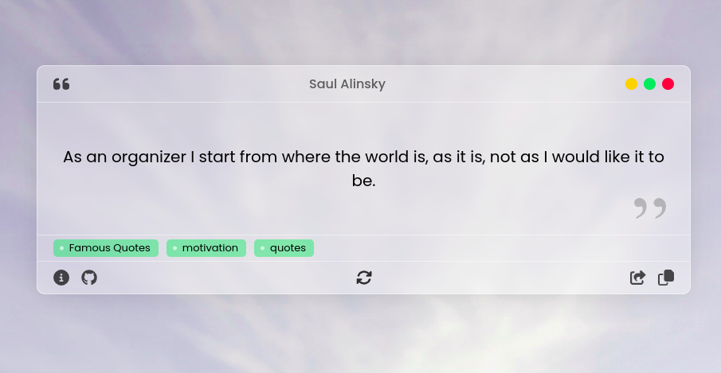
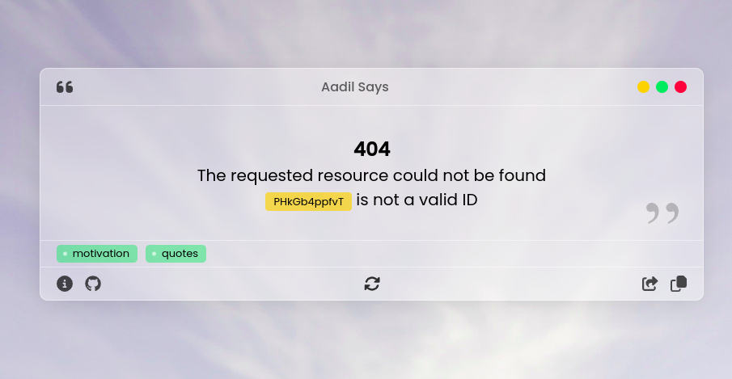
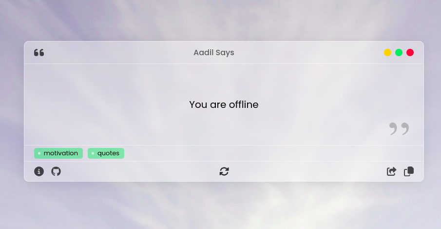
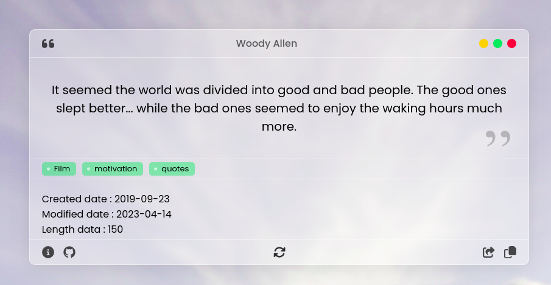

# Random Quote Generator

A simple web application that displays random inspirational quotes. Built with modern web technologies to provide a seamless user experience.

## Features

- Fetches and displays random quotes from an API
- Clean and responsive user interface
- Handles offline functionality gracefully
- Error handling for invalid requests
- Detailed view for each quote

## Screenshots

### Main View

### Error State

### Offline Mode

### Quote Details

## API Information

The application uses the [Quotable API](https://api.quotable.io/) to fetch random quotes. The API provides:

- Random quote generation
- Access to a vast collection of inspirational quotes
- Author information for each quote
- Tags and categories for better organization
- Rate limiting of 180 requests per minute

### API Endpoints Used

- `/random`: Fetches a random quote
- `/quotes/:id`: Retrieves detailed information about a specific quote

For more information about the API, visit their [documentation](https://github.com/lukePeavey/quotable).

